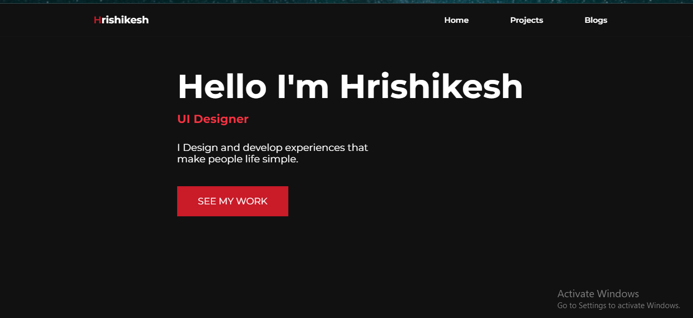

# Project :- Portfolio Website

### What I Learned from this Project?

- I learned about positioning around the webpage.
- I also learned how to add different fonts from the Google fonts.
- I also learned how to design Buttons and Navbar.
- Learnd to use css position [Relative & Absolute] property.

### This project took around 8 hours to complete.

### Project Link : [Link](https://hrishi-portfolio.netlify.app/)

### Screenshot

